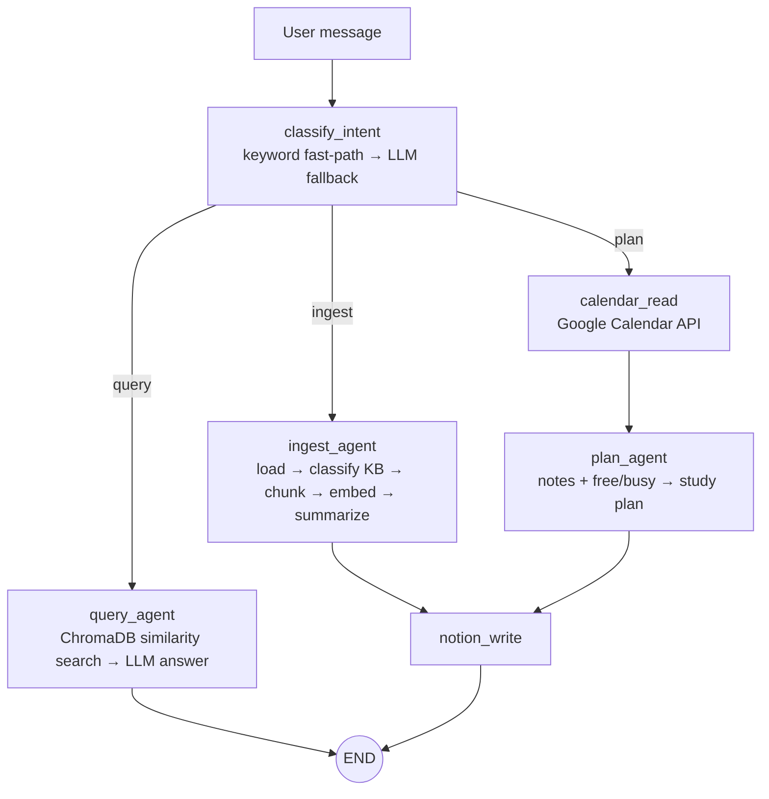

# MyMind — Local-first Personal Knowledge Assistant

A multi-agent RAG assistant that runs entirely on your machine. Ask questions about your own documents, ingest new ones, and generate study plans that respect your Google Calendar — with no document ever leaving your laptop (LLM via Ollama, embeddings via a local HuggingFace model).

> LangGraph · RAG · ChromaDB · Ollama · FastAPI · React

## What it does

| Intent | Example | What happens |
|--------|---------|--------------|
| **Query** | "What parameters did my thesis use for the fuzzy extractor?" | Vector search across knowledge bases → grounded answer with sources |
| **Ingest** | Drop a PDF, or paste a URL / text | Chunk → auto-classify into a knowledge base → embed → summarize → log to Notion |
| **Plan** | "Plan my TOEIC prep before 5/31, target 860" | Read Google Calendar → retrieve relevant notes → weekly schedule around existing events → save to Notion |

Messages can be in Traditional Chinese, English, or mixed.

## Architecture



The graph is a [LangGraph](https://github.com/langchain-ai/langgraph) state machine (`backend/agent.py`). `/chat/stream` exposes per-node progress over Server-Sent Events so the UI can show which agent is working.

**Knowledge bases** (one Chroma collection each): `thesis`, `meetings`, `study`, `tech`, `general`.

### Design decisions

- **Local-first.** Ollama + a local sentence-transformers model means private notes and papers never hit a third-party API.
- **Keyword fast-path before the LLM router.** A small 8B model occasionally misroutes obvious commands ("add this to my knowledge base"); deterministic keyword rules handle those instantly and the LLM only decides ambiguous cases.
- **Query searches the predicted KB first, then the rest**, so a misclassified question still finds its answer.
- **Optional integrations degrade gracefully.** Without Notion or Calendar credentials the app still works; the plan agent just asks the user to pick time slots.

## Quick start

Prerequisites: Python 3.11+, Node 18+, [Ollama](https://ollama.com).

```bash
# 1. Model
ollama pull llama3.1:8b

# 2. Backend (http://localhost:8001)
cd backend
python3 -m venv .venv && source .venv/bin/activate
pip install -r requirements.txt
cp .env.example .env          # fill in Notion / Google settings if you want them
uvicorn main:app --reload --port 8001

# 3. Frontend (http://localhost:5174)
cd frontend
npm install && npm run dev
```

Notion and Google Calendar are optional — see the comments in `backend/.env.example` for setup. To connect Calendar, open `http://localhost:8001/auth/google` once.

### Tests

```bash
cd backend
pip install -r requirements-dev.txt
pytest
```

## API

| Endpoint | Description |
|----------|-------------|
| `POST /chat` | Run the agent graph, return the final result |
| `POST /chat/stream` | Same, streamed per node (SSE) |
| `POST /upload` | Upload a `.pdf` / `.txt` / `.md` (≤ 20 MB) and ingest it |
| `GET /kbs`, `GET /health` | Knowledge-base sizes, integration status |
| `GET /auth/google[/callback\|/status]` | Google Calendar OAuth |

## Security notes

- Secrets (`.env`, Google credentials/token) and the local vector store are git-ignored.
- `ingest_source` from API clients is restricted to `http(s)` URLs; local file paths can only originate from `/upload`.
- CORS is limited to `FRONTEND_URL`. The server is intended for localhost use — put authentication in front of it before exposing it to a network (URL ingestion will fetch any URL it is given).

## Known limitations / roadmap

- No relevance threshold on retrieval: weak matches are still passed to the LLM as context.
- No retrieval evaluation yet (planned: small QA set measuring hit-rate@k).
- Uses `langchain_community` wrappers that are deprecated in favour of `langchain-ollama`, `langchain-chroma`, `langchain-huggingface`.
- Conversation history is not persisted between requests.

## Tech stack

LangGraph · LangChain · ChromaDB · Ollama (llama3.1:8b) · sentence-transformers (all-MiniLM-L6-v2) · FastAPI · React 19 + Vite · Notion API · Google Calendar API

## License

MIT
